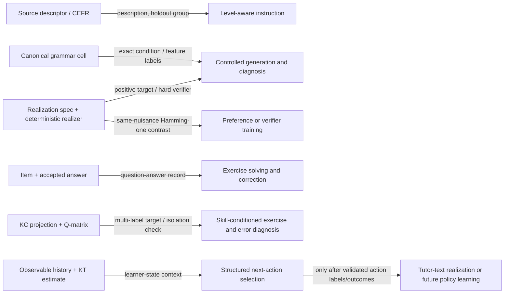

# Grammar-KT as supervision for LLM post-training

> **Historical architecture note.** This investigation records the
> pre-five-module deterministic-realiser pipeline at the commit named below.
> Its `RealizationSpec`, lexical-frame, and `item_opportunity_id` terminology is
> retained as historical evidence and does not describe the active pipeline.
> See `docs/refactor-report.md` for the current architecture.

Investigation date: 2026-08-25  
Repository commit inspected: `f8e810e478d32c782649f5fa575a124e842d465c`
(working tree already contained unrelated researcher changes; all work here is
isolated under `experiments/post_training/`).

## Executive answer

Grammar-KT already provides useful **structural supervision**, especially for
controlled generation, exercise solving, grammar judgement, correction, and
feature-level error diagnosis. Its unusual asset is not free synthetic prose:
it is the traceable relation among a source descriptor, an exact six-feature
grammar cell, a deterministic realization, factorized KCs, Q-matrix edges, and
an observed correctness history.

The natural first pathway is:

> exact positive SFT → deterministic verifier filtering / best-of-N → a small
> targeted-preference ablation if hard near misses remain.

Free-form tutor-feedback SFT is not ready: the repository has no authentic
learner responses, gold explanations, human feedback, or pedagogically
validated tutor actions. RL is even less justified. The current simulator is a
controlled KT research world, not a validated teaching environment: action
choice has no modeled causal effect beyond presenting an item, there is no
retention outcome, and no expert optimal action.

Two diagnostics support that restrained recommendation:

- The current 24-cell inventory yielded 644 SFT views, 132 fluent Hamming-one
  preferences, and 264 factorized verifier records. All 132 pairs pass their
  construction invariants; a response-only surface classifier scores chance
  (0.50), although the symmetric pair design partly guarantees that result.
- A zero-shot test with one instruction model hit a ceiling: all three input
  representations produced the exact answer on all 24 cases. Canonical input
  showed **no measurable gain** over a natural-language description. The same
  model selected the deterministic winner for all 48 sampled pairs in both
  candidate orders. This establishes that the contrasts are legible, not that
  they improve pedagogy or post-training.

Training was not run by design: the diagnostic gate did not establish a
non-ceiling benchmark, and this environment has no versioned training stack,
local checkpoint, or GPU. A tiny fine-tune now would answer less than building
a harder, leakage-safe evaluation first.

## 1. What the current pipeline actually contains

The executor order in `src/grammar_kt/runner.py` is:

```text
source → normalisation → canonical → realisation → items → simulation
       → KC selection → frozen KC projection → Q-matrix → KT
```

This order matters. Items and synthetic learner events are generated before KC
selection; the same fixed evidence is subsequently projected through a frozen
KC ontology. Thus a post-training export should remain a **derived view**, not
feed KC labels into item generation and compromise the KT comparison.

There is also no file-to-file handoff from saved `realisation/realisations.jsonl`
to the item bank. The realisation stage saves source-preserving representative
specs; the item stage returns to canonical cells and invokes the same admissible
spec/realizer functions over a broader controlled opportunity grid. Simulation
then consumes accepted items, not realization rows. This is deliberate shared
logic, but provenance exporters must not mistake the representative realization
file for the complete item opportunity space.

| Stage | Information actually retained | Natural supervision | Important boundary |
| --- | --- | --- | --- |
| Source | Full selected EGP rows; Phase-1 projection of `egp_id`, super/subcategory, guideword, can-do; sample strata/units and duplicate design; snapshot hash | Natural-language/CEFR source description; provenance and source-holdout group | EGP snapshot is external and absent locally; a fresh full run cannot currently be reproduced |
| Normalisation | Rendered prompts, raw model attempts, schema errors, Phase-1/2 mappings, routing, result class, exact/partial cells, note, repeat reliability | Structured prediction from descriptors; uncertainty/attrition label | Mapping labels are model-generated, not human gold; only complete mappings contribute cells |
| Canonical | Stable cell ID; exact `tense, aspect, voice, polarity, clause, modal`; descriptor IDs/counts; edge index and source note | Controlled-generation condition; feature class; counterfactual axis | Six fields deliberately exclude many lexical/discourse/semantic distinctions |
| Realisation | Stable spec and derivation: frame, subject, WH role, imperative subtype, surface, tokens, operations, agreement site, auxiliary chain | Exact target; morphological/operation labels; constrained candidate check | The realizer validates its controlled sublanguage, not arbitrary English; current imperative auxiliary-chain metadata should be audited before use |
| Items | Opportunity, item/family/contrast IDs, prompt, singleton exact answer, accepted answers, target, realization spec, source IDs, canonical fold; deterministic checks plus model diagnostic booleans for structural plausibility, naturalness, world knowledge, unsupported construction, and suspected answer ambiguity | Exercise solving; generation; exact correctness; contrastive ranking | Only controlled transformation exists; no MCQ distractors, cloze, free production, feedback, or dialogue; model diagnostic labels are automated rather than human |
| Simulation | Learner ID/order, item, split, binary correctness; private oracle feature projection/mastery; declared latent profile, difficulty and update mechanics | Observable histories for state inference; binary outcome; schema-level transitions | No learner answer text or error cause. Private oracle state must not be exposed as if observable. Events precede KC projection and item order is not an expert policy |
| KC selection/projection | Candidate rules, support/identifiability/contrast diagnostics, selection trace, frozen policy; rich KC cards; item→KC projections | Skill classification, target-KC conditioning, feature-level diagnosis | KCs are a chosen measurement representation, not innate linguistic truth |
| Q-matrix | KC inventory, sparse item–KC edges and coverage/identifiability diagnostics | Multi-label supervision; isolation/coverage checks | An item can have several KCs; Q edges do not identify which KC caused an observed error |
| KT | Observable projected histories, empirical/BKT/logistic estimates, metrics, frozen Phase-D states/probes | Learner-state conditioning; correctness prediction | State is an estimator conditional on a KC policy, not a gold cognitive state or teaching-action label |

### Missing signals

The repository does **not** currently contain learner-written answers,
token/edit error spans, misconception annotations, explanations, hints,
distractors, teacher feedback, tutor dialogues, human preferences,
level-appropriateness judgements, or observed learning gains under alternative
teaching actions. A synthetic Hamming-one sentence can stand in for a learner
error during structural feasibility testing, but it must remain labeled as
synthetic rather than silently promoted to authentic learner behavior.

### Data-flow diagram



The short mapping is:

| Pipeline representation | Post-training signal | Candidate behavior |
| --- | --- | --- |
| Grammar cell | structured instruction and exact feature label | realize or identify a construction |
| Realization | exact positive, constraint result, alternate-cell near miss | constrained generation, verification, correction |
| KC/Q row | multi-label target and concept coverage | KC-conditioned item generation or diagnosis |
| Item + answer | supervised input/output and solvability check | solve, transform, judge |
| Synthetic wrong realization + target | exact feature delta | identify one controlled grammatical mismatch |
| Observable history / KT state | state context | choose a target KC, format, or hint level |
| Candidate outputs + hard/soft rubrics | vector labels or pair | rerank/reject; later, preference optimization |

## 2. Post-training opportunity map

| Task | Pipeline supervision | Natural objective | Automatic labels? | Expected value | Main risk / current readiness |
| --- | --- | --- | --- | --- | --- |
| Grammar-controlled generation | Cell + spec + exact realization | SFT; verified best-of-N; optional preference | Yes, within controlled realizer | High: tests structural compositionality | Current 24-case fixed lexicon is ceiling-level; arbitrary paraphrases cannot be accepted |
| Exercise solving | Prompt + singleton accepted answer | SFT / exact evaluation | Yes | Medium: clean but prompt already exposes every feature | Can become template copying rather than grammar transfer |
| Exercise generation | KC/cell/state/format → item | SFT then verifier/ranking | Partly: realization, target presence, answer; not pedagogical quality | High after multiple formats/lexical frames exist | One format now; “isolates the KC” is nontrivial for multi-KC items |
| Grammar judgement | Condition + candidate → validity/feature error | Multi-task SFT or verifier | Yes for controlled candidates | High: direct use of counterfactual structure | Does not validate arbitrary English or semantic naturalness |
| Error diagnosis | Exercise + learner response → correctness, KC, feature delta | Structured SFT/classification | Exact for synthetic Hamming-one errors; partial otherwise | High: cleanest novel task if authentic errors are later added | An incorrect event currently lacks answer text; Q row alone does not locate the causal KC |
| Error correction | Exercise + controlled wrong response → target | SFT / exact check | Yes for synthetic contrasts | Medium-high | Trivial if target prompt and fixed lexicon nearly determine answer |
| Corrective feedback | Error diagnosis + learner state → hint/explanation | SFT, pairwise ranking, rubric verifier | Grammar/targeting partly; usefulness/revealingness require people or validated judges | Potentially high | No gold feedback. Current 48 hints are weak templates, not train-ready pedagogy |
| Tutor response | State/history + structured action → text | SFT after action selection | Text realization partly; pedagogical policy no | Future | Conflates policy with language and invites judge artifacts |
| Next KC/item/strategy selection | KT state + candidate set → structured action | Supervised ranking or contextual bandit later | No optimal labels now; item validity yes | Highest-value KT connection | Current simulator has random exhaustive presentation and no causal action effects |
| Learner-state inference | Observable history/dialogue → KT state/correctness | SFT/distillation or sequence prediction | Yes relative to fitted KT model, not human truth | Medium; can make KT legible to LM | Distills model assumptions and can leak future/outcome or private oracle state |
| Learner simulation | State + item/action → response | Conditional model / environment model | Binary outcomes synthetic; text absent | Useful for pipeline stress tests | Circular training/evaluation and simulator exploitation; not learner evidence |
| Preference judgement | Context + two Hamming-one realizations | Pairwise classifier/DPO/IPO | Yes structurally | Medium if SFT still makes subtle errors | Symmetric pairs can be easy; no demonstrated gain beyond SFT |
| Reward/verifier model | Context + candidate → dimension vector | Multi-label SFT/ranking | Hard dimensions yes; soft dimensions no | High for reranking and auditable evaluation | Scalarization hides tradeoffs; learned judge can overfit templates |

### Task-specific conclusions

**A. Grammar-controlled generation.** Canonical cells work as structured
instructions, but a usable benchmark must hold out complete grammar cells,
lexical frames, and templates. The current validator can certify exact outputs
from its own realization space. Positive examples are direct. Meaningful
negatives are outputs valid for an alternative cell under identical nuisance
conditions; malformed strings are unnecessary.

**B. Exercise generation.** Today this reduces to regenerating a tightly
specified controlled-transformation item. The promising research version
separates latent opportunity from format and realizes the same cell as cloze,
transformation, minimal-pair judgement, correction, or dialogue completion.
Generation is SFT when a canonical target item exists, ranking when candidates
compete for isolation/difficulty, and verifier filtering when hard constraints
decide validity. It is not automatically an RL problem.

**C. Error diagnosis.** For controlled counterfactuals, the target and response
cells give an exact feature delta, and KC projections give missing/extraneous
skills. The model input should normally omit the gold cell/KC if the research
claim is inference from learner text; those remain labels/evaluation metadata.
For a tutor already told the target KC, a separate claim can test using—not
inferring—that state. Authentic learner answers are needed to extend beyond
synthetic one-feature errors.

**D. Corrective feedback.** Use a pipeline: deterministic correctness →
structured diagnosis → feedback. Score grammar accuracy and target-match as
hard dimensions; revealingness, usefulness, level fit, and explanation quality
as separate human-grounded soft dimensions. Never treat a templated hint as a
validated preferred answer merely because it names the correct feature.

**E/F. Tutor response and next action.** Prefer a structured action such as
`{target_kc, item_format, strategy, difficulty_band}` and realize text only
afterward. This makes state ablations and constraints interpretable. A
supervised/ranking policy is the right baseline once teacher decisions or
counterfactually justified labels exist.

**G. Learner simulation.** It can produce controlled state histories and test
whether a method recovers the simulator's declared state. It cannot, by itself,
show that a tutor teaches humans. Training and evaluation must use different
simulator families or, preferably, an authentic held-out interaction set; raw
student-generation quality, behavioral calibration, and cognitive consistency
must be audited independently.

## 3. Atomic records and information boundaries

Use transparent JSONL records rather than a production class hierarchy. The
atomic unit should be a **view of one grammatical opportunity or one observed
transition**, with a complete immutable provenance block:

```text
record → item → item opportunity → realization → canonical cell
       → source descriptor(s), plus KC-policy/fold/prompt/builder versions
```

| Field | Model input | Hidden generation metadata | Label | Evaluation only |
| --- | --- | --- | --- | --- |
| Public task instruction, item text, learner answer/history available at serving time | yes | no | no | no |
| Canonical cell / target KC | yes for controlled generation or a tutor explicitly given curriculum state; **no** for diagnosis/KC inference | may guide generation | target for inference tasks | useful for scoring |
| Realization spec | yes only when the deployed model will receive it | yes for surface construction | structured target/check | useful for invariance analysis |
| Accepted answer | no, unless answer-rewrite is the task | may generate candidates | output for solving/correction | gold exact check |
| Source/CEFR description | optional public context | can set sampling/level | level/category target | source-group split |
| Private simulator oracle mastery/profile | never | may create a synthetic world | never call human truth | simulator audit only |
| KT estimate based on past observable events | yes for state-conditioned policy | no | target for state inference | state ablation |
| Stable IDs | no; they create memorization shortcuts | yes | no | provenance/leakage grouping |
| Future outcome or post-action state | never at decision time | no | trajectory outcome | off-policy evaluation |

### Representative records

Full examples are in
[`representative_examples.json`](results/feasibility_v0/representative_examples.json).
The intended minimal shapes are:

```json
{"record_type":"sft","task":"grammar_controlled_generation",
 "model_input":{"canonical_structure":{"tense":"past","aspect":"none","voice":"active","polarity":"negative","clause":"declarative","modal":"none"},"realization_spec":"..."},
 "response":"I did not write the report.","provenance":"..."}
```

```json
{"record_type":"preference","task":"grammar_controlled_generation",
 "context":{"canonical_structure":"...","target_kcs":["KC_FINITE_PAST","KC_NEGATION"]},
 "chosen":"I did not write the report.",
 "rejected":"I had not been writing the report.",
 "preference_label":{"differing_dimension":"aspect","hamming_distance":1,
   "rejected_is_valid_for_alternative_cell":true},"provenance":"..."}
```

```json
{"record_type":"verifier","context":"...","candidate":"I had not been writing the report.",
 "reward_dimensions":{"exact_requested_realization":0,
   "target_kc_alignment":0,"grammatical_under_some_controlled_cell":1,
   "difficulty_appropriateness":null,"pedagogical_quality":null}}
```

```json
{"record_type":"dialogue","model_input":{"exercise":"...",
 "learner_response":"I had not been writing the report.","learner_state":null},
 "response":"Check the requested auxiliary chain and verb form, then try the sentence again.",
 "labels":{"actual_error_dimension":"aspect","label_strength":"weak_template_demonstration",
   "pedagogical_quality_validated":false}}
```

```json
{"record_type":"trajectory","learner_state_t":{"estimator":"observable smoothed KC success","kc_mastery_proxy":"..."},
 "teaching_action_t":{"action_type":"present_existing_item","selection_policy":"not an expert action"},
 "learner_response_t":{"correct":1},"learner_state_t_plus_1":"...",
 "evaluation_only":{"action_optimality_label_available":false}}
```

The dialogue and trajectory records demonstrate schemas only. They should not
be placed in a training mixture until their labels acquire pedagogical meaning.

## 4. Preference construction and verifier design

For context (c), realization conditions (r), target cell (g), KC set
(K_g), and optional observable learner state (s_{l,t}), a structural pair is

\[
(c,r,g,K_g,s_{l,t}) \rightarrow y^+ \succ_d y^- ,
\]

where (y^+=R(g,r)), (y^-=R(g',r)), cells (g,g') differ only on named
dimension (d), and the same realization nuisance signature is valid for both.
This yields a specific claim: “valid for the requested cell” beats “fluent and
valid, but for the neighboring cell.” It does not claim the chosen response is
more natural in every context.

Two negative routes should remain distinct:

1. **Structural perturbations:** complete-cell alternatives differing in tense,
   aspect, voice, polarity, clause type, or modal while holding lexical/frame
   conditions fixed. Advantages: exact label, interpretable error, no judge
   cost. Risks: artificial symmetry, incomplete dimension coverage, and easy
   template cues.
2. **Model candidates + filtering/ranking:** sample multiple answers; reject
   hard-invalid candidates and ask human/validated judges only about remaining
   soft differences. Advantages: realistic model errors and varied prose.
   Risks: judge bias, self-preference, hidden invalidity, cost, and poor
   reproducibility if the model snapshot is unpinned.

Do not turn every invalid output into a DPO pair. Deterministic validity is most
directly used as a binary constraint, evaluator, or rejection-sampling filter.
Preference training becomes informative when both responses are plausible and
the rejected behavior is a failure that persists after SFT.

### Reward dimensions

| Dimension | Source | Current status |
| --- | --- | --- |
| Exact requested realization | exact target / deterministic realizer | deterministic binary in controlled space |
| Target construction/feature present | cell/spec derivation | deterministic for controlled candidates |
| KC alignment | frozen item→KC projection | deterministic relative to declared KC policy |
| Grammatical under another controlled cell | alternate realization | deterministic; distinguishes wrong-target from gibberish |
| Answer correctness/solvability | singleton accepted answer | deterministic for current item family |
| Unintended KC isolation | compare target and realized Q rows | partly deterministic; interpretation depends on KC policy |
| Difficulty/state appropriateness | learner state + response model | not currently identified or causally validated |
| Error-target match in feedback | exact error dimension/KC + response analysis | structural part checkable; prose entailment needs a validated judge |
| Does not reveal answer | gold answer vs feedback | heuristic/model/human; not reliably deterministic |
| Explanation usefulness, level fit, tone | pedagogical rubric | human labels, with model judges only after agreement audit |

Use a vector of independent dimensions. At selection time apply hard constraints
lexicographically—valid grammar, target/KC alignment, solvability—before soft
pedagogy. A scalar weighted sum is not warranted: it could trade an incorrect
construction for a polished explanation and conceal why systems differ.

## 5. Ranked research questions

1. **RQ1 — structural learnability and generalization.** Does SFT on
   provenance-preserving Grammar-KT records improve target-KC realization and
   grammar judgement on held-out lexicalizations and complete cells, compared
   with an instruction model and natural-language-only SFT?
2. **RQ2 — value of the representation.** When prompts do not expose the gold
   answer, do raw canonical/spec inputs add value beyond equivalent prose, and
   does the effect persist on a non-ceiling, diverse realizer?
3. **RQ3 — value of structural preferences.** On hard, plausible Hamming-one
   errors, does SFT+verified best-of-N already capture the benefit, or does
   SFT+IPO/DPO improve feature-error rejection and unseen-cell generation?
4. **RQ4 — diagnosis before feedback.** Can a model infer correctness and the
   responsible grammatical feature/KC from an exercise plus learner answer,
   first on controlled errors and then on a small human-annotated learner set?
   Does explicit diagnosis improve human-rated feedback targeting?
5. **RQ5 — measurable use of learner state.** Given the same recent text
   history and candidate actions, does a frozen observable KT state improve
   next-KC/item/strategy selection against teacher choices or real downstream
   outcomes? Compare state, history-only, and shuffled-state conditions.

RQ1–RQ3 form the smallest coherent structural paper. RQ4 connects that result
to language tutoring with a modest human annotation study. RQ5 is a distinct
second phase requiring real action labels/outcomes. Dialogue formatting and RL
are not standalone RQs until those prerequisites exist.

## 6. Experiments and results

The hypotheses, independent/dependent variables, controls, and decision rules
were recorded **before execution** in
[`preregistered.md`](protocols/preregistered.md). Raw outputs are retained; no
failed runs were discarded.

### Experiment 1: derived-record feasibility

**Hypothesis.** The current structure can yield ≥500 SFT views and ≥100 fluent,
traceable, Hamming-one preference pairs, ≥10 per observed error dimension, with
100% construction validity and no response-only surface classifier above 0.65.

**Setup.** Historical `runs/base` canonical cells were the declared input; all
58 items, factorized KC projections, Q-matrix edges, preferences, and simulator
views were regenerated with current code, seed 20260825. Pairs share a frame,
subject, WH condition, and imperative subtype. Complete provenance determines
the split: if either member is held out, the pair is evaluation-only. A
character 2–5-gram TF-IDF logistic classifier used five-fold GroupKFold by the
complete nuisance signature.

**Commands.**

```bash
.venv/bin/python experiments/post_training/scripts/build_records.py
.venv/bin/python experiments/post_training/scripts/evaluate_feasibility.py
```

**Results.**

| Measure | Result |
| --- | ---: |
| Canonical cells / items / KCs / Q edges | 24 / 58 / 9 / 123 |
| SFT / preference / verifier records | 644 / 132 / 264 |
| Weak dialogue / schema-only trajectory records | 48 / 64 |
| SFT tasks | generation 58; solving 58; diagnosis 132; correction 132; judgement 264 |
| Pair dimensions | aspect 60; tense 36; polarity 24; clause 12 |
| Train-development / compositional-evaluation pairs | 68 / 64 |
| Deterministic pair validity | 132/132 (1.00) |
| Unique candidate strings / strings in both roles | 49 / 49 |
| Response-only grouped classifier | 0.50 |

**Interpretation.** The feasibility gate passed. Canonical counterfactuals can
produce a useful structural data view with no arbitrary ungrammatical text.
The 0.50 shortcut result is limited: every directed pair has its reverse and
every candidate appears as both chosen and rejected, so chance performance is
partly a design consequence, not proof of broad quality. Voice and modal have
no same-nuisance Hamming-one pair; modal KC support is only one item. The bank
also has just 49 candidate strings, one format, and a fixed lexicon.

**Decision.** Keep the transparent exporters and structural records as an
experimental extension. Expand lexicon/format/cell coverage and construct a
hard split before training. Do not train on weak dialogues or treat random
trajectory actions as demonstrations.

Artifacts: [`manifest.json`](data/feasibility_v0/manifest.json),
[`summary.json`](results/feasibility_v0/summary.json), and the complete
[`data/feasibility_v0`](data/feasibility_v0/) directory.

### Experiment 2: zero-shot representation ablation

**Hypothesis.** Canonical + explicit realization constraints will improve exact
accuracy; a ≥10 percentage-point gain over equivalent prose is the predeclared
representation-value gate.

**Setup.** One item per each of 24 cells was batched under three conditions:
natural-language feature description, raw canonical cell + realization spec,
and canonical cell + existing explicit item constraints. Model:
`gpt-5.6-luna`, low reasoning, Codex CLI 0.149.1, seed 20260825 for case/order
construction. The hosted snapshot and decoding implementation were not pinned.

**Command.**

```bash
.venv/bin/python experiments/post_training/scripts/run_model_diagnostics.py generation
.venv/bin/python experiments/post_training/scripts/evaluate_model_diagnostics.py
```

**Result.** Every condition scored 24/24 exact with 24/24 one-sentence format
compliance. Improvement over prose: 0.0 percentage points. Gate: **failed**.

**Interpretation.** This is a ceiling and therefore an uninformative comparison,
not evidence that canonical structure lacks value or that prose is best. The
fixed frame lexicon and only 24 opportunities make exact production unusually
easy.

**Decision.** Do not use this benchmark to motivate representation-specific
post-training. First add lexical frames and hold out cells/frames/templates;
test smaller local instruction models and feature-interaction stress cases.

### Experiment 3: structural preference validity and order sensitivity

**Hypothesis.** An independent judge will select the exact structural winner
at least 90% of the time and change its semantic decision for at most 10% of
exactly reversed A/B orders.

**Setup.** Twelve pairs from each observed error dimension (48 total), sampled
deterministically, anonymized as A/B, then evaluated in seeded and exact-reverse
orders with the same model/config as Experiment 2. The judge also named the
single error dimension.

**Command.**

```bash
.venv/bin/python experiments/post_training/scripts/run_model_diagnostics.py preference
.venv/bin/python experiments/post_training/scripts/evaluate_model_diagnostics.py
```

**Result.** Preference accuracy was 48/48 in both orders; error-dimension
accuracy was 48/48 in both orders; semantic order consistency was 48/48 and
inconsistency 0/48. Gate: **passed**.

**Interpretation.** The pairs express legible grammatical distinctions and this
judge showed no order effect on the sample. This is not independent human
pedagogical validation—the judge belongs to the same general model family used
for the generation diagnostic—and it says nothing about whether DPO improves a
student-facing model.

**Decision.** Retain these pairs for a future controlled preference ablation,
but compare them first with SFT and verifier-filtered best-of-N. Build a human
spot-check and a second model judge for soft pedagogical pairs.

All raw case manifests, prompts, JSON schemas, event logs, outputs, stderr,
invocation commands, timestamps, and runtimes are under
[`prompt_ablation_v0`](results/prompt_ablation_v0/); the
[`manifest`](results/prompt_ablation_v0/manifest.json) hashes every retained
input/output. Five calls took 87.02 s in
total. Hosted-model monetary cost was not exposed by the CLI and is therefore
reported as unavailable, not estimated.

### Training and RL: recorded non-runs

Tiny SFT and DPO/IPO were **not run by design**. `torch`, `transformers`,
`datasets`, `peft`, and `trl` were absent; no local model/checkpoint or GPU was
available. More importantly, Experiment 2 did not supply a non-ceiling held-out
task. Installing a training stack and choosing an arbitrary model would add
cost without answering the predeclared research question.

Sequential RL was also not run. The environment lacks action-dependent,
human-calibrated transitions and delayed learning/retention outcomes. Optimizing
against it would demonstrate recovery or exploitation of simulator mechanics,
not tutoring effectiveness. These are methodological negative results, not
implementation failures.

### Reproduction environment

- Linux 7.1.9 x86_64; Python 3.14.7; Intel i7-9700K, 8 cores; approximately
  15 GiB RAM; no GPU available.
- NumPy 2.5.1, scikit-learn 1.9.0, PyYAML 6.0.3; exact project dependencies are
  governed by the repository environment.
- Commit and dirty flag, input/output hashes, seed, prompt/config versions, and
  exact commands are in each manifest/invocation. The dirty flag is retained
  because pre-existing researcher changes were not modified or hidden.

## 7. Evaluation and leakage protocol

Random record splits are invalid. Two records can share a source descriptor,
cell, realization template, frame, nuisance signature, item prompt, and even a
candidate string. Split the latent provenance graph before deriving records.

Recommended evaluation partitions:

1. **Lexical transfer:** held-out subjects, predicates, objects, complements,
   with known cells/templates. This measures surface generalization.
2. **Template/format transfer:** same opportunity, held-out transformation,
   cloze, correction, judgement, or dialogue format. This tests separation of
   grammar opportunity from interaction format.
3. **Compositional cell holdout:** unseen combinations of individually observed
   feature values. This is the main structural generalization test.
4. **Feature/KC holdout:** a genuinely unseen value/KC; report as a harder
   transfer setting, not alongside interpolation.
5. **Source-descriptor holdout:** all descendants of a descriptor held out,
   particularly for natural-language descriptor mapping.

For a preference, its target **and rejected** provenance chains determine its
partition. Never train on a sentence/cell and then call its reverse pair held
out. Stable IDs and target strings should not enter model input.

Evaluation dimensions should remain disaggregated:

- structural: exact/parsed cell match, target feature presence, hard validator,
  contradictory features, KC alignment, solvability;
- pedagogical: actual error targeted, hint revealingness, usefulness, level fit,
  and state/action appropriateness;
- dataset: provenance-component overlap, exact/semantic duplication, lexical
  and template leakage, cell/KC/format/difficulty coverage;
- model: exact/structured accuracy, feature-error confusion matrix, verifier
  AUROC/calibration, preference win rate, and performance by held-out unit.

Use LLM judges only for dimensions not answered by structure. Require JSON
rubrics, blinded condition names, randomized response order, exact reversals on
a subset, raw-prompt retention, per-dimension scores, and human/judge agreement.
Multiple judges are useful only after checking that they add independent
information. A single vague quality score is not an evaluation suite.

## 8. Item-format programme

The desired abstraction is:

\[
\text{grammar opportunity} \quad \perp \quad \text{interaction format}
\]

conditional on the information each format legitimately exposes. The same
cell/spec can support:

| Format | Derivation | Deterministic evaluation |
| --- | --- | --- |
| Controlled transformation | current prompt + exact target | exact answer |
| Cloze | mask one finite/auxiliary/main-verb span | exact token/span; check unique answer |
| Minimal-pair judgement | target vs Hamming-one realization | pair validity and named feature delta |
| Error correction | present alternative-cell realization | exact corrected sentence and error dimension |
| Multiple choice | target plus structurally typed distractors | unique keyed answer; distractor feature labels |
| Sentence transformation | source realization + requested feature delta | exact target cell under fixed nuisance conditions |
| Dialogue completion | embed an opportunity in a short context | structural target check; naturalness remains soft |
| Free production | cell/KC only | parser/grammar checker needed; current exact string validator is insufficient |
| Corrective explanation | learner answer + diagnosis | structural target-match plus human-grounded soft rubric |
| Adaptive multi-turn | observable state + structured actions | needs validated action labels and outcomes |

The highest-information next data experiment is a within-opportunity format
matrix: several lexicalizations of the same cell rendered as transformation,
cloze, minimal pair, correction, and judgement. Train on some formats and test
on another while keeping the cell partition explicit. This tests whether the
model learns grammar semantics or prompt templates.

## 9. Knowledge tracing and the RL decision

Let the observable estimate be

\[
s_{l,t,k}=P(K_k\text{ mastered}\mid H_{l,t}),
\]

derived only from events before decision time. It can condition target KC,
difficulty, item format, hint specificity, explanation depth, and strategy. A
clean experiment supplies the same candidates and history under: true frozen
state, history only, shuffled state, and perhaps oracle state **only as an upper
bound in simulation**. The outcome must be a teacher choice or a real later
performance measure, not self-consistency with the same KT model.

### What a real RL formulation would require

| Element | Defensible formulation | Current availability |
| --- | --- | --- |
| State | past observable items/responses, frozen KT vector, recent dialogue, curriculum constraints | Partly: binary histories and KT estimates; no learner text |
| Action | preferably structured `{target_kc, item_id/format, strategy, hint_level}`; text generated downstream | Candidate item/KC actions exist; no expert/optimal label and only one format |
| Reward | delayed held-out learning/retention, possibly constrained by burden/difficulty; immediate correctness is only an auxiliary measure | Absent; simulator has immediate outcomes under declared mechanics |
| Transition | human-calibrated response/state update conditional on action and content | Synthetic update exists but does not validate causal pedagogical effects |
| Episode | a bounded learning session plus delayed probe/retention assessment | Synthetic shuffled passes only |

At present the problem is closer to offline supervised ranking or a contextual
bandit with missing counterfactual reward than to supported sequential RL. RL
would become testable only after multiple meaningful actions influence a
validated learner model and a held-out learning-gain/retention signal exists.
Even then, compare with greedy weakest-KC, spaced/review heuristics, supervised
teacher-policy imitation, and myopic bandits. Use simulator families not seen
during optimization and real-data validation to detect reward hacking.

## 10. Generalization beyond English

The reusable layer consists of typed grammatical features, a language-specific
realizer/parser, KC rules, item-format transformations, provenance, and learner
state. Exact English fields (`tense/aspect/voice/polarity/clause/modal`),
auxiliary ordering, do-support, subject–verb agreement, WH inversion, articles,
fixed word order, and the current lexicon are language-specific.

Another language may need case, gender/noun class, evidentiality, mood,
politeness, switch-reference, agreement controllers, pro-drop, clitic position,
or non-concatenative morphology. Therefore “canonical grammar” should mean a
versioned language/schema plugin, not a universal six-axis table. The general
contract is:

\[
\text{typed canonical structure} + \text{language realizer/parser}
+ \text{KC projection} + \text{learner model} \rightarrow
\text{post-training views}.
\]

Preference generation transfers when two valid realizations can share nuisance
conditions and differ on one meaningful feature. Exact surface equality may
not transfer where word order or morphology admits several correct forms; a
language-specific analyzer must then replace singleton string matching.

## 11. Recommended design

### Implement now

- Keep a small, experimental JSONL exporter with a common provenance block and
  separate SFT, preference, and verifier views. Do not introduce a production
  class hierarchy.
- Prioritize generation, judgement, controlled diagnosis, and correction.
  Preserve factorized verifier dimensions and chain-safe splits.
- Expand realization/lexical coverage and add 3–5 deterministic item formats
  before any training claim. Add a parser or set-valued acceptance for less
  constrained production.
- Build a non-ceiling evaluation and then run one small instruction-base SFT
  against base and natural-language-only controls. Report by cell, lexicon,
  source, and format split.
- Audit the current imperative derivation metadata before using auxiliary-chain
  labels for supervision.

### Promising future work

- Verified best-of-N/rejection sampling, then SFT+IPO or SFT+DPO only on hard
  near misses, with filtered-SFT as a required baseline.
- A small authentic learner-error annotation: answer text, edit/evidence span,
  cell delta/KC, and teacher feedback on targeting/revealingness. Use it to test
  synthetic-to-real transfer.
- State-conditioned structured action selection once teacher actions or real
  downstream outcomes exist. Separate policy selection from text realization.
- Human-validated feedback rubrics and multiple model judges for scaling soft
  dimensions after agreement/order-sensitivity audits.
- A second language/schema to demonstrate that the opportunity/format/provenance
  abstraction, rather than the English auxiliary system, is the contribution.

### Investigated but not justified

- Free-form RL or GRPO against the current simulator.
- Training a scalar reward model that mixes hard grammar with soft pedagogy.
- Treating synthetic binary incorrect events as learner error diagnoses.
- Training on the 48 weak templated dialogue records or 64 random-action
  trajectories.
- Claiming canonical prompting superiority from the current ceiling test.
- Claiming preference optimization adds value before SFT and verified best-of-N
  are run on a hard held-out benchmark.

## 12. Direct answers to the decision questions

1. **Unique supervision:** exact feature-structured realizations, factorized
   KC/Q projections, same-nuisance grammatical counterfactuals, observable KT
   state, and an end-to-end provenance chain derived from one latent grammar
   opportunity.
2. **Realistically learnable behaviors now:** controlled generation, solving,
   judgement, correction, and synthetic feature diagnosis. Exercise-format
   transfer is next. Useful feedback/policy needs new labels.
3. **Atomic unit:** a serializable view of a provenance-linked grammatical
   opportunity; for adaptation, a transition whose state uses only prior
   observable evidence.
4. **Deterministic vs model-based:** grammar realization, exact answer,
   controlled feature delta, and policy-relative KC alignment are deterministic.
   Naturalness outside the controlled space, pedagogy, level fit, revealingness,
   and action quality require human-grounded judgement.
5. **Preference beyond SFT:** not yet demonstrated. It is plausible for subtle,
   fluent feature errors, but must beat SFT and verifier-filtered best-of-N on
   held-out cells.
6. **Learner-state value:** not yet measurable with current labels. The proper
   test is structured action selection with true/shuffled/history-only state
   and an external action/outcome target.
7. **RL justified?** No. The present sequence lacks credible causal action
   effects and delayed learning reward.
8. **One representation for several layers?** Yes as a shared latent/provenance
   backbone, provided item generation stays ontology-independent, KC/KT are
   projections, and each post-training task exposes only legitimate fields.
9. **Smallest ACL-style experiment set:** leakage-safe multi-format dataset;
   base vs prose-SFT vs structured-SFT on held-out lexical/cell splits;
   verified best-of-N; one targeted IPO/DPO ablation; human audit of structural
   pairs and a small authentic error-transfer set. The current diagnostics are
   feasibility evidence, not the paper result.
10. **Main pipeline vs extension:** main pipeline should expose stable
    provenance, split assignments, exact/set-valued validators, and perhaps
    format-neutral opportunities. JSONL post-training views, model calls,
    training, preference/judge experiments, and trajectories belong in the
    isolated experimental area until validated.

## 13. Claim boundary and repository caveats

The archived `runs/base` was produced under an older repository state and does
not validate as a current end-to-end run. The external EGP source required to
regenerate source and normalisation is absent. This study therefore uses only
its declared 24-cell canonical inventory and regenerates current downstream
deterministic artifacts. It does not reuse archived policy-specific events and
does not claim a fresh source-to-KT result.

The repository also contains manuscript/report material describing older
policy-specific simulation designs. The current executor's item/simulation
before KC-selection ordering is authoritative for this investigation. Any
paper text should be reconciled with that implementation before publication.

The exact validator failure and source-path availability check are retained in
[`results/repository_audit_v0`](results/repository_audit_v0/).

See [review.md](literature/review.md) for the detailed literature table and
[paper_notes.md](paper_notes.md) for a compact manuscript scaffold.
